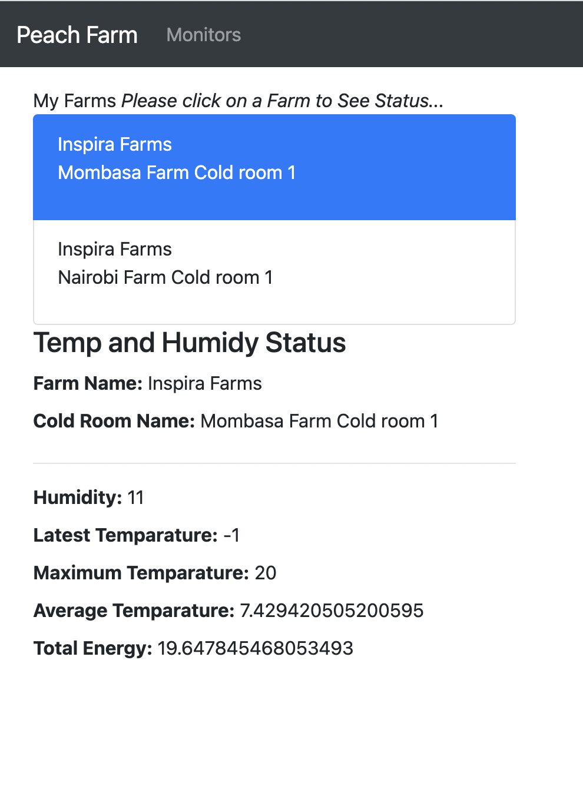
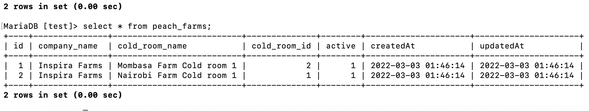

I propose to impliment this projects using the following tools
a. Node js - Backend
b. React Js -  Frontend
c. MQTT - Queue Manager
d. InfluxDB - manage raw and Big data

    The diagram below show the entire implimentation. 

 
Web Version 
 

  
  

  Mobile Version 
  

  

This project is separated into two sub-parts
1. Database
2: Frontend
3. Backend

Step one.
Create a Mysql databse called Peach_farm which will store details of the farm and Cold rooms

 
CREATE TABLE peach_farms (
    id INTEGER AUTO_INCREMENT NOT NULL,
    company_name varchar(255) NOT NULL,
    cold_room_name varchar(255) NOT NULL,
    cold_room_id int(10) unsigned NOT NULL,
    active bit NOT NULL,
    PRIMARY KEY (id)
) ENGINE=InnoDB DEFAULT CHARSET=latin1;

To create the above table however, I used the backend migrations technologies to enable create the database tables. This is important since the migrations process will:

1. auto create timestamps
2. Auto Seed with at least 1 record.

1. Database Design.

 

  

 

  

 
1. Frontend
    This is basically the user interface that is client facing and is intended to read data from backend through APIs
    I designed this page using React JS framework due to its simplicity and ability to design Mobile friendly pages.
2. Backend
    This is the back facing implimentation which exposes end-point API and interact with the storage and subscriptions of feeds from the MQTT. 

    The General assuptions is that, an IOT devices is mounted in a certain environments which is broadcasting data periodically to the MQTT server.

    For the Purpose of This Projects and simulations. I have generated and simulated the 1000 feeds Per seconds and sored the same into a file called. `iot_data.json`.
    The iot_data.json will be published to the MQTT using the commands below
        `node app/controllers/mqtt_publisher.js`

    I have also create a subscriber on the same file to enable me consumer data that is being published into the MQTT and pull the same into the InfluxDB. 

    To simplify the Process, I combined the functionality. But Idealy the subscriber process and functionality out to have been implimented separated and through a process manager such as `superviserd` so as to monitor and ensure that the subscriptions process and writing to the influxDB is always up and running.

    APIs
    For the Purpose of the assignment, I have provisioned 4 end-points from the backends to enable my Applications display data from both Mysql and Influx Databases.

    Mysql
    The Mysql databases is to store static data about the cold rooms. This will be usefull in later implimentations in case other cold room are launched thus enabling scalability of the app. 
    
    InfluxDB.
    Since the Assignment is about Time Series Data and instruction of the assignment, all the feeds subscriptions from the MQTT will be feed into the influx Databases. Since our focus more of data from a specific intance of time, I did decide to collect all the meter readings at once and relate the same to a specific instance of time.

    For example in real time sscenarios, a device is configure to broadcast specific data periodically. This means, I can collect all data elements e.g humity, temparature, Kilo Watts and send the in once call to the MQTT. This I will avoid overlapping calls to the MQTT for individual data elements or measurements. 

    Therefore, I can combine all the measurements into several fields and publish the same using one call. The below filed shows the measurements

    > select * from TemperatureSensor limit 10
        name: TemperatureSensor
        time             cold_room_id   humidity kws_energy temperature
        ----             --------       -------- ---------- ------------ 
        1646241007385629 1              6        50         9           
        1646241062206670 1              5        52         -8             
        1646241062208376 1              4        51         7             
        1646241062208806 1              4        54         0            
        1646241062208931 1              6        52         7            
        1646241062209194 2              5        59         2            
        1646241062209313 2              6        54         3            
        1646241062209587 2              6        57         7            
        1646241062209916 2              4        50         9             
        1646241062210028 2              6        60         0             
        >
    
    API END_POINTS

    The API END-POINTS are as show below
    Methods	 Urls	                                    Actions                         From Database
    ----    --------                                    ----------                      ------------ 
    GET	    /api/peach-farm/company/1	                get Details of the Cold Rooms   Mysql
    GET	    /api/peach-farm/get-latest-humidity/1	    get Latest Humidity             InfluxDB
    GET	    /api/peach-farm/get-latest-temparature/1	get Latest temparature          InfluxDB
    GET	    /api/peach-farm/get-maximum-temparature/1	get Get Max Temparature         InfluxDB
    GET	    /api/peach-farm/get-avg-temparature/1	    get Avarage Tamparature         InfluxDB
    GET	    /api/peach-farm/get-total-energy/1	        get total energy consumed       InfluxDB

Frontend

Exercise B:
1. If you had more time and resources, how would you improve this feature/process?
This is an exciting field of IOT Devices and integrations. I wwould improve in the following aspects
    1. I would procure a real Device to simulate real world solutions. There exist devices such as Raspbery PI that can actually be programmed to simulate the above brodcasting of change of measurements such as humidity or Temparature periodically. 

    2. This being Timeseries Data, I would take advanatage of Graphical representations and impliment Both Graphical User Interface and Charts.

    3. Since the Coldrooms are installed in a specific locations, I would configure GPS for each coldroom which would then enable me to display the coldroom on Web maps that have clickable/Touch event thus taking advantage of latest Web Map Technologies.

    4. Finaly, I would most importantly introduce a layer of security by autheneticating all My ENd-Points using JWT(Json Web Tokens). This will disallow any authorized access and interferance with the critical informations and resources of the company

2. Can you think of a way to tackle the problem our users have from another direction or with a different approach?

    The Solutions above is perfects. Mine is just to introduce additional concepts to handle scalability and growth of the solutions in terms of Usage and Traffic. My Solutions would be to Dockerize the entire infrustructure and setup kubenetis for all the user who would like to self host the solutions. However, AWS would also be sufices for user who have Amazon Web Service Subscriptions

3. If you had to set up the infrastructure behind this feature in AWS, how would it look like? 

 
    
